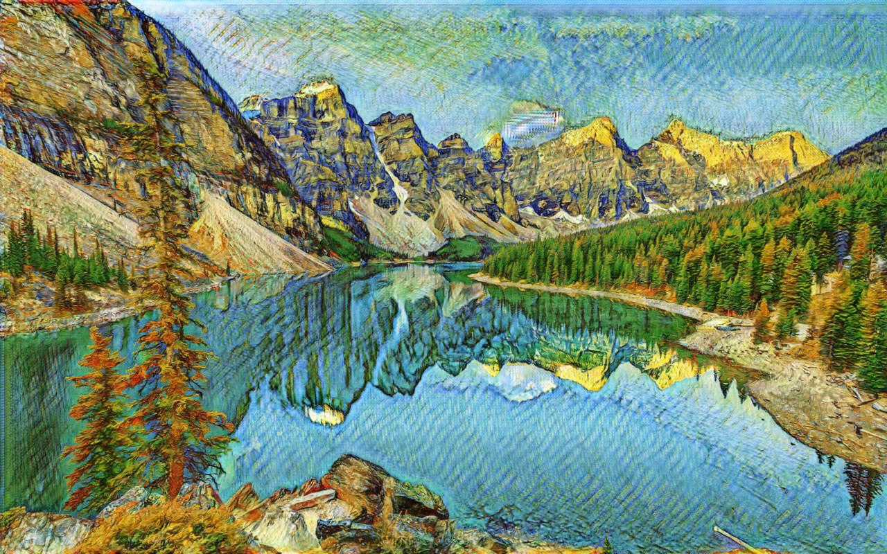
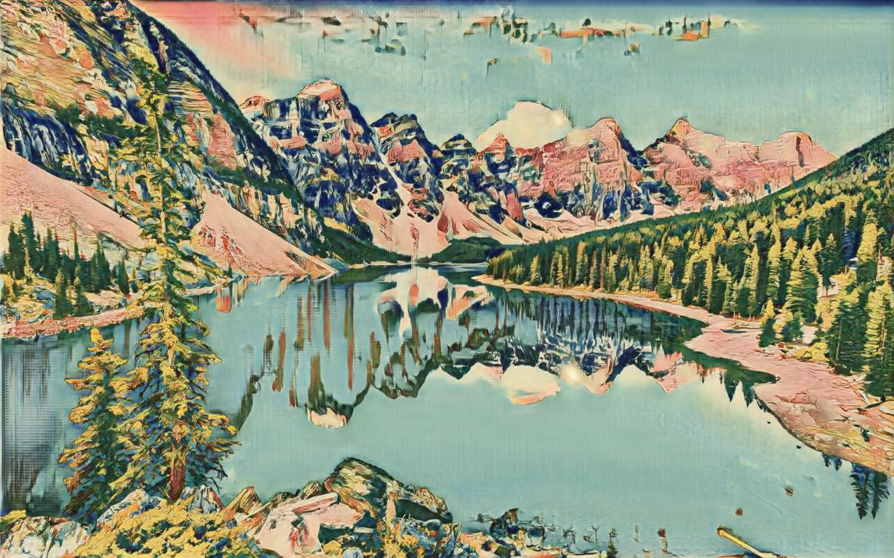
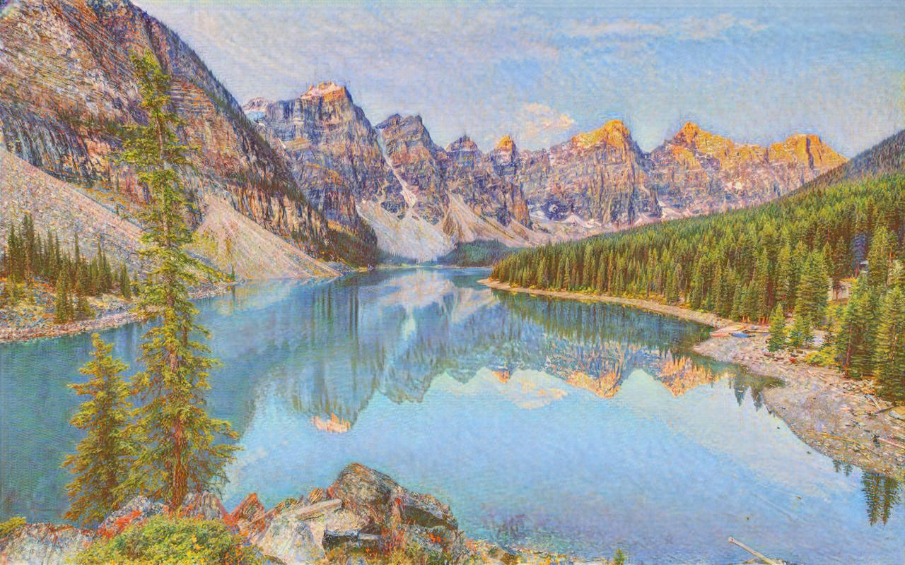
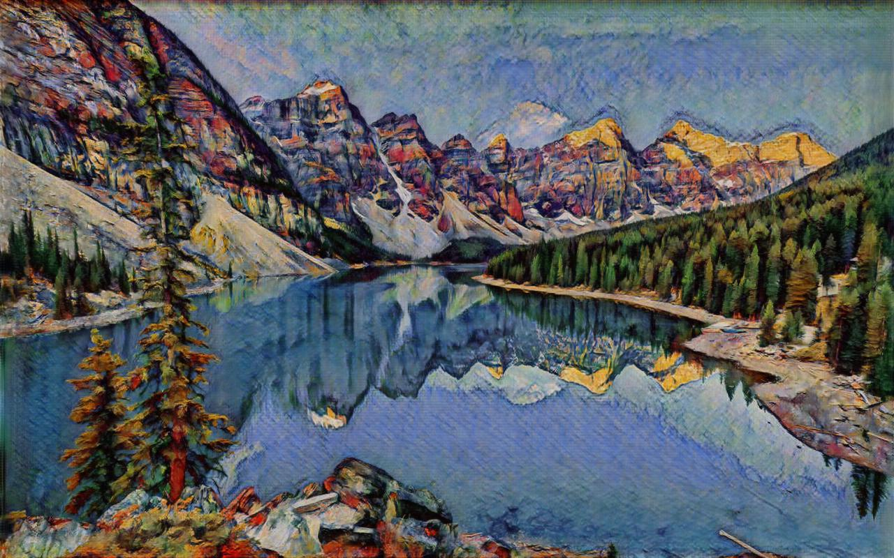
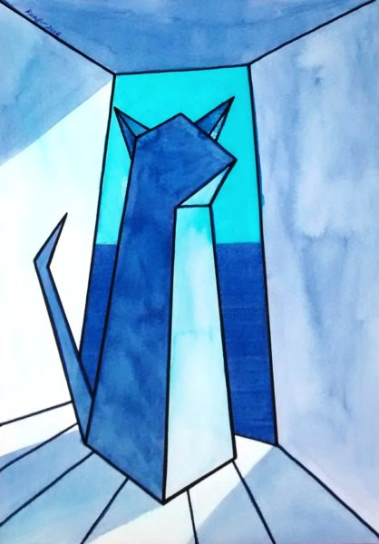
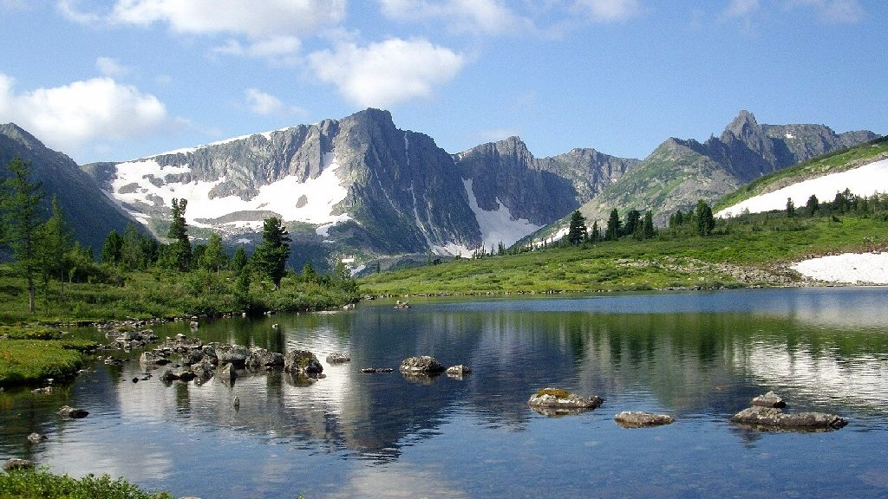
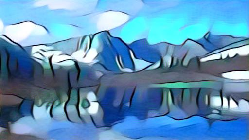

# Telegram бот для переноса стиля изображений на основе NST и CycleGAN

Данный бот был разработан в качестве выпускного проекта первого семестра продвинутого потока Deep Learning School(DLS) МФТИ в 2023 году.

## Описание проекта

Данный бот представляет собой telegram бота для переноса стиля изображений с помощью двух моделей: ***Neural style transfer*** и ***CycleGAN***, описанных в статьях: [A Neural Algorithm of Artistic Style](https://arxiv.org/abs/1508.06576) и [Unpaired Image-to-Image Translation using Cycle-Consistent Adversarial Networks](https://arxiv.org/abs/1703.10593).

 В качестве модели *CycleGAN*\`а была взята и адаптирована его [официальная реализация](https://github.com/junyanz/pytorch-CycleGAN-and-pix2pix) на [PyTorch](https://pytorch.org/).

## Запуск бота

Для запуска бота необходимо:

1. Клонировать репозиторий:
```
$ git clone https://github.com/nikitalotts/tg-style-transfer-bot.git
```

2. Установить необходимые библиотеки:
```
$ cd ./tg-style-transfer-bot
$ pip install -r requirements.txt
```

3. Записать токен от бота в файл `config.py` (директория `/bot`, как его получить можно посмотреть [здесь](https://dash11.comm100.io/kb/100/f9627b0c-6ff8-45c5-bdf5-b627f234d9bf/a/c8c7d736-f458-42ff-a863-f41b24fa5d02/where-do-i-find-telegram-bot-token)):
```
# так должно выглядеть содержимое файла

$ cat ./bot/config.py
token = 'your_token'
```

4. Запустить скрипт:
```
python ./run.py
```

После этого бот будет готов к работе.

## Режимы работы

Как уже было сказано ранее, бот поддерживает обработку изображений с помощью двух моделей: ***NST*** и ***CycleGAN***.


#### Neural Style Transfer

`input:` два изображения форматов `.jpg`, `.jpeg` или `.png`:

* **Первое изображение (style image)**: изображение, с которого будет взят стиль для переноса.

* **Второе изображение (content image)**: изображение, на которое будет перенесен стиль первого изображения

`output:` одно изображение формата `.jpg`, `.jpeg` или `.png`; вторая картинка, на которое был перенесен стиль первой  


#### CycleGAN

`input:` одно изображение формата `.jpg`, `.jpeg` или `.png`:
* **Входное изображение (input image)**: изображение, на которое будет перенесен один из стилей худжников

`artist_name`: имя художника в чей стиль нужно перенести входное изображение(выбирается из меню). Возможные значения:
* `Vangogh:` стиль художника Винсента ван Гога.
* `Ukiyoe`: стиль художника Укиё-э.
* `Monet`: стиль художника Клода Моне
* `Cezanne`: стиль художника Поля Сезанна

`output:` одно изображение формата `.jpg`, `.jpeg` или `.png`, на которое был перенесен стиль выбранного художника

*Примечание: бот поддерживает отправку изображений, как в формате фото, так и в формате документов, как в формате нескольких изображений в одном сообщение, так и по одному изображению в сообщении*
 

## Примеры работы

#### Внешний вид бота при работе


<br/><br/>
Далее будут показаны результаты работы бота

#### CycleGAN

###### Inputs

`Входное изображение:`


<sub>Источник: [ссылка](https://medium.com/checkinstory-blog/5-breath-taking-places-around-the-globe-that-actually-exist-dfec6d421cff)<sub>

###### Outputs

`artist_name: Vangogh:`



`artist_name: Ukiyoe:`



`artist_name: Monet:`



`artist_name: Cezanne:`




#### Neural Style Transfer

###### Inputs

`Изображение стиля:`



<sub>Источник: [ссылка](https://papik.pro/risunki/legkie/46157-legkij-risunok-kubizm-53-foto.html)<sub>

`Изображение контента:`



<sub>Источник: [ссылка](https://touristam.com/kuzbass.html)<sub>

###### Outputs

`Выходное изображение:`



## Deployment

Бот был развернут и запущен на хостинге *[Beget](https://beget.com/ru)* и доступен по ссылке:

Tg: [@ImagesStyleChangerBot](https://t.me/ImagesStyleChangerBot)

 *Примечание: бот был развернут на срок до 30.01.2023, если Вы читаете это после этого числа, скорее всего, бот уже отключен*

## Использованные материалы

>[aiogram 3.x guide](https://mastergroosha.github.io/aiogram-3-guide/quickstart/)

>[aiogram’s documentation](https://docs.aiogram.dev/en/latest/)

>[Neural Style Transfer](https://neerc.ifmo.ru/wiki/index.php?title=Neural_Style_Transfer)

>[Neural Transfer Using PyTorch](https://pytorch.org/tutorials/advanced/neural_style_tutorial.html)

>[CycleGAN](https://github.com/junyanz/CycleGAN)

>[CycleGAN and pix2pix in PyTorch](https://github.com/junyanz/pytorch-CycleGAN-and-pix2pix)